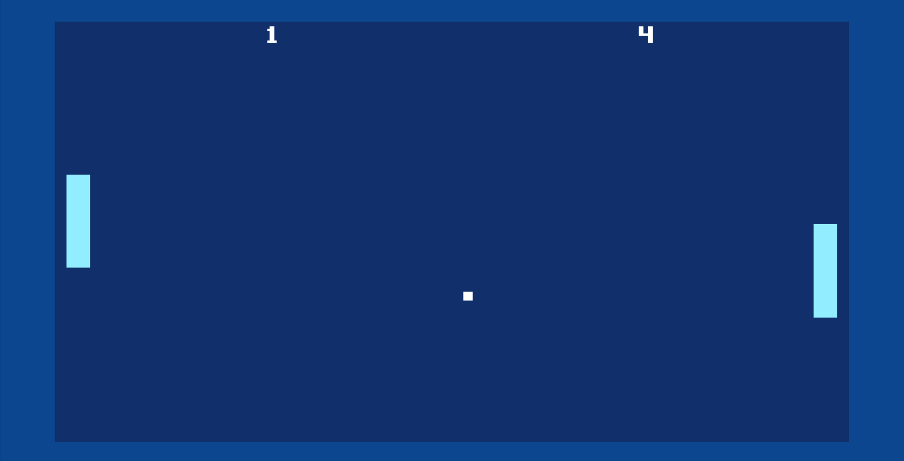
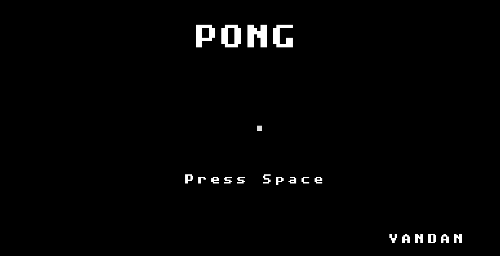
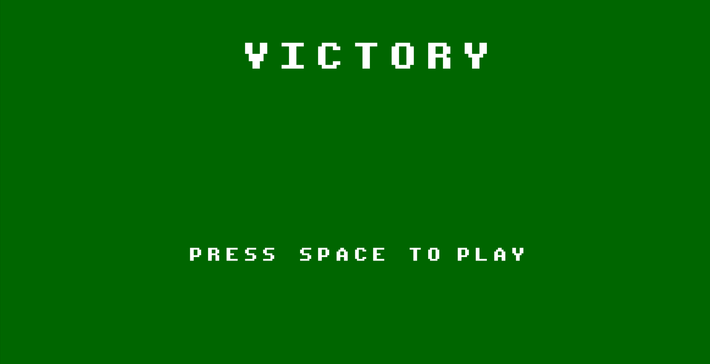
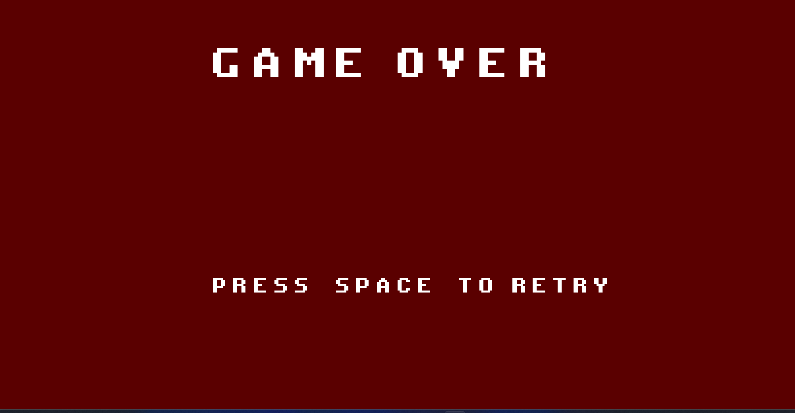

# Pong (Win32 C++)

A Pong clone written in C++ using the Win32 API.

This project was built as part of my journey to learn game programming and improve my understanding of C++. The game was developed without using a game engine, focusing instead on low-level concepts such as rendering, input handling, game loops, and project architecture.

## Screenshots

### Gameplay



### Intro Screen



### Victory Screen



### Game Over Screen



## Features

* Player-controlled paddle
* AI-controlled opponent
* Custom bitmap font rendering
* Intro screen
* Win/Lose game states
* Delta-time based movement
* Asset loading using stb_image

## Technologies Used

* C++
* Win32 API
* Visual Studio
* stb_image

## Project Structure

```text
game.cpp               // Game logic and state management
renderer.cpp           // Rendering functionality
win32_platform.cpp     // Win32 platform layer
platform_common.cpp    // Shared platform code
utils.h                // Utility functions
assets/                // Game assets
```

## Building

1. Open `Pong.vcxproj` in Visual Studio.
2. Select a build configuration.
3. Build and run the project.
